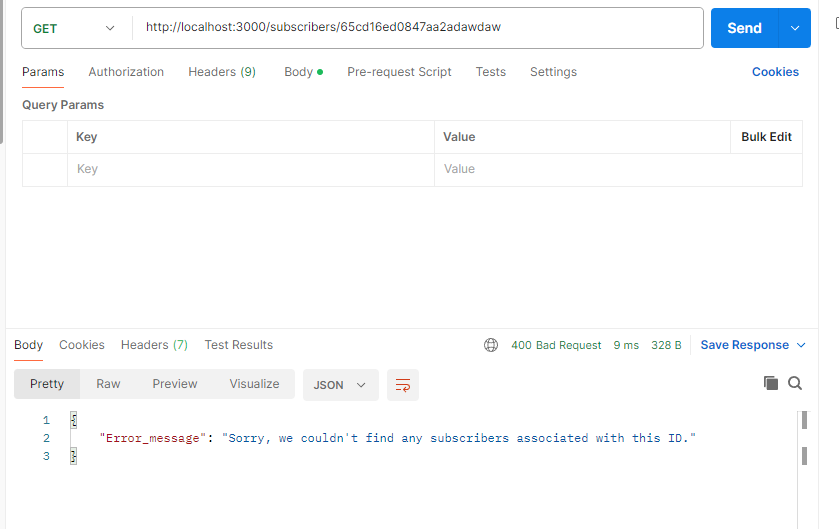

# Get YouTube Subscribers API Documentation

## Introduction

The guide for using the YouTube Subscribers API explains how to access subscriber data through its endpoints.

## Base URL
The base URL for all endpoints is:
 ```
  http://localhost:3000
 ```
## Authentication

This API's public endpoints don't need authentication. You can start using them by making the required HTTP requests.

## Error Handling

If something goes wrong, the API will send back the right error codes and messages. Check out the HTTP status codes page for details [HTTP status codes](https://developer.mozilla.org/en-US/docs/Web/HTTP/Status).

## Endpoints
- [Get Subscribers](#get-subscribers) (`/subscribers`) 
- [Get Subscribers by Names](#get-subscribers-by-names)   (`/subscribers/names`)
- [Get Subscriber by ID](#get-subscriber-by-id)  (`/subscribers/:id`) 

  ### Get Subscribers 
  ---
  **Description:** Get a list of all subscribers.

  - **Endpoint:** `/subscribers`
  - **Method:** `GET`
  - **Response:**
    - Status Code: `200 OK`
    - Content-Type: `application/json`
    - Example Response:
    

      <!-- ```json
      [   
        {
          "_id": {"$oid": "65cd16ed0847aa20417b3cc1"},
          "name": "Jeread Krus",
          "subscribedChannel": "CNET",
          "subscribedDate": {"$date": "2024-02-14T19:39:25.336Z"},
        },
        {
          "_id": {"$oid": "65cd16ed0847aa20417b3cc2"},
          "name": "John Doe",
          "subscribedChannel": "freeCodeCamp.org",
          "subscribedDate": {"$date": "2024-02-14T19:39:25.338Z"}
        },
        {
          "_id": {"$oid": "65cd16ed0847aa20417b3cc3"},
          "name": "Lucifer",
          "subscribedChannel": "Sentex",
          "subscribedDate": {"$date": "2024-02-14T19:39:25.338Z"},
        }
      ]
      ``` -->
  - **Endpoint-Specific Error**
    - 400 Bad Request error
    - 404 Not Found error
    - Error : `500 (Bad Request)`
    - Error Message: `Internal Server Error`
   


  ### Get Subscribers by Names
  ---
  **Description:** Get subscribers by their name.
  - **Endpoint:** `/subscribers/names `
  - **Method:** `GET`
  - **Query Parameters:**
    - `names` (required): The names of the subscribers to find.
  - **Response:**
    - Status Code: `200 OK`
    - Content-Type: application/json
    - Example Response:
    
      <!-- ```json
      [
    {
        "name": "Jeread Krus",
        "subscribedChannel": "CNET"
    },
    {
        "name": "John Doe",
        "subscribedChannel": "freeCodeCamp.org"
    },
    {
        "name": "Lucifer",
        "subscribedChannel": "Sentex"
    }
        ]
      ``` -->
  - **Endpoint-Specific Error**
    - Status Code: `500 (Bad Request)`
    - Message: `Internal Server Error`

  ### Get Subscriber by ID
  ---
  **Description:** Get a specific subscriber based on their ID.
  - **Endpoint:** `/subscribers/:id`
  - **Method:** `GET`
  - **Query Parameters:**
    - `id` (required): The ID of the subscriber to get data.
  - **Response:**
    - Status Code: `200 OK`
    - Content-Type: `application/json`
    - Example Response:
    
      <!-- ```json
      {
    "_id": "65cd16ed0847aa20417b3cc2",
    "name": "John Doe",
    "subscribedChannel": "freeCodeCamp.org",
    "subscribedDate": "2024-02-14T19:39:25.338Z",
    "__v": 0
        }
      ``` -->
  - **Endpoint-Specific Error**:
    - Status Code: `400 (Bad Request)`
    - Message: `Sorry, we couldn't find any subscribers associated with this ID.`
    - Example Response:
    

###


> [!REMINDER]
> Remember to prioritize data privacy and security when utilizing the API endpoints. Make sure to transmit sensitive user data securely and limit the exposure of unnecessary information.

## Conclusion

This API documentation offers a detailed manual for accessing subscriber information through API endpoints. Should you have any inquiries or face challenges, don't hesitate to contact us.

Keep in mind that APIs may evolve over time. Stay informed about our updates to leverage new features, enhancements, and improvements.


